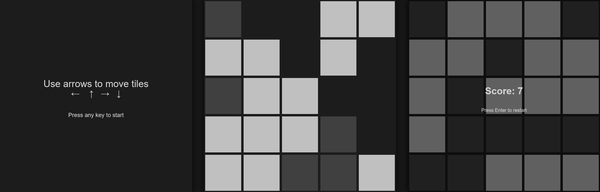

## Description

This repository contains a source files of the small browser puzzle game [Four Sides](https://shekn.itch.io/four-sides). This game is written on [TypeScript](https://www.typescriptlang.org/) by using simple HTML 2d-Canvas for graphics and [bitECS](https://github.com/NateTheGreatt/bitECS) library for game logic.



## Game rules

The game is a mix of tetris and 2048.

You have a canvas with square tiles of two colors. At each step you can shift all tiles to one of four direction by using arrow keys. After move some random tiles are appear. If a line (vertical or horizontal) contains tiles of one color, then it disappears and the global score increased by 1. The game finish when there are no empty space on the canvas.

## Game versions

It is possible to create different versions of the game by tweaking values in the ```constants.ts``` file. Some versions are easy to play infinitely, in some of them it's impossible to get at least 1 item in the score.

There are three parameters, which define the gameplay:
* ```TILES_COUNT``` the number of tiles in horisontal and vertical axis
* ```TILES_PER_STEP``` how many tiles appears at each step
* ```TILES_PROBABILITIES``` is array of relative numbers, which defines the probability of each tile type when it generates. The length of this array define the number of different tile types. If all values in the array are the same, then all tiles will appear with the same probability

Other parameters defines visual. There are some recommendations with their values:
* decrease ```TILES_PADDING``` when increase ```TILES_COUNT``` to reduce the visual distance between tiles
* increase ```START_MOVE_SPEED``` when increase ```TILES_COUNT```